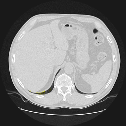
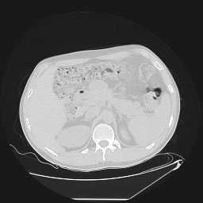

# CT_RegSegm
Segmentation of lungs in 3D Computed Tomography (CT) scans via non-rigid image registration scheme [\[1\]](#references).

Short description of the current implementation can be found in [\[2\]](#references). 

### Requirements

Running the scripts requires 
* __Python 3.6+__ with the following packages installed
(all installable via *pip*):

```
numpy
scikit-image
scipy
pandas
nibabel
imageio
```

* __Elastix__ tool installed in your `PATH`. 
The tool can be downloaded from the website (http://elastix.isi.uu.nl/) 
or installed on Unix systems via: 
   
```
sudo apt install elastix
```

* Download the __[CT_RegSegm_data.tar](https://drive.google.com/open?id=1x6nM5Z4_o8S_7DInp2rgqCwFoxrcMLpb)__
archive and extract its content (`resized_data` and `test_data`) 
into the repository root directory.  

### Running the scripts

The scripts can be run directly from Python (see [go_c_regsegm.py](go_c_regsegm.py))
or from command line using [run_regsegm.py](run_regsegm.py) script. Examples:

```
python3 run_regsegm.py test_data/test_image.nii.gz
```

If succeeded, the `*_regsegm_py.nii.gz` files containing the lung masks should appear.

Result examples:

  

### References

[1] Sluimer I, Prokop M, van Ginneken B. Toward automated
segmentation of the pathological lung in CT. IEEE Trans
Med Imaging 2005;24(8):1025–1038. 
(URL: https://www.ncbi.nlm.nih.gov/pubmed/16092334)

[2] Liauchuk, V., Kovalev, V.: ImageCLEF 2017: Supervoxels and co-occurrence for
tuberculosis CT image classification. 
In: CLEF2017 Working Notes. CEUR Workshop Proceedings, Dublin, Ireland, 
CEUR-WS.org <http://ceur-ws.org> (September 11-14 2017) 
(URL: http://ceur-ws.org/Vol-1866/paper_146.pdf).
